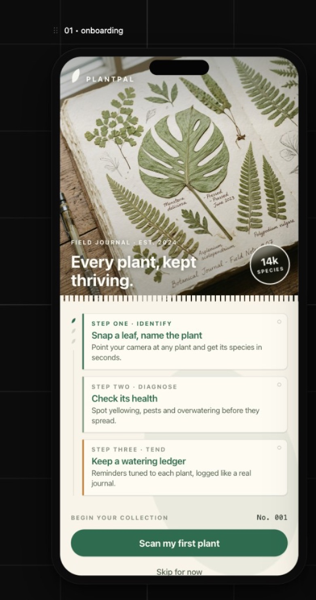
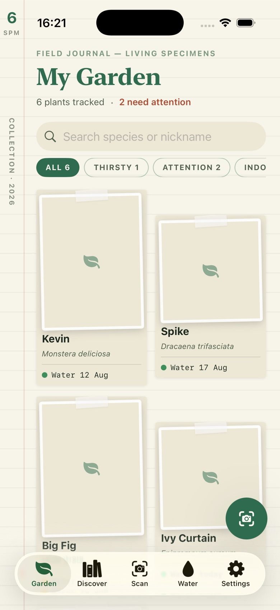
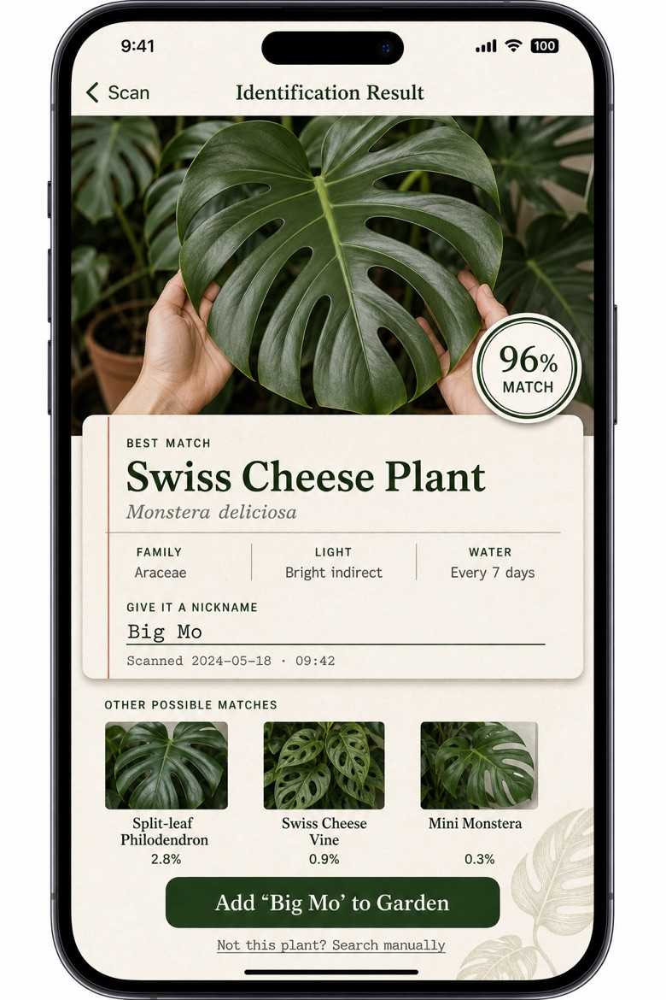
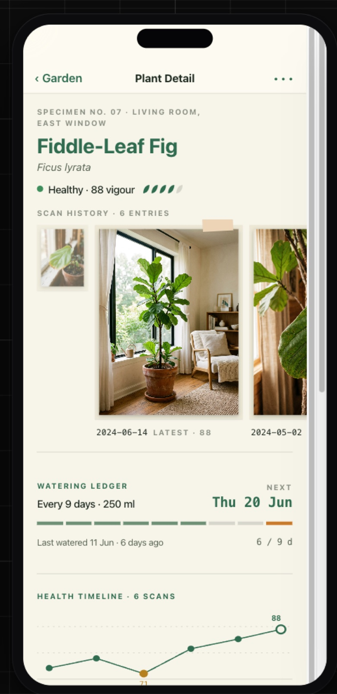
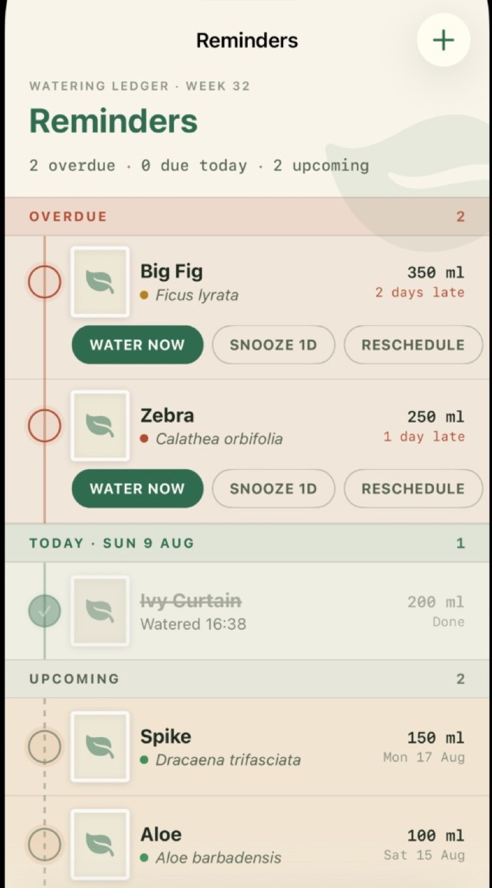
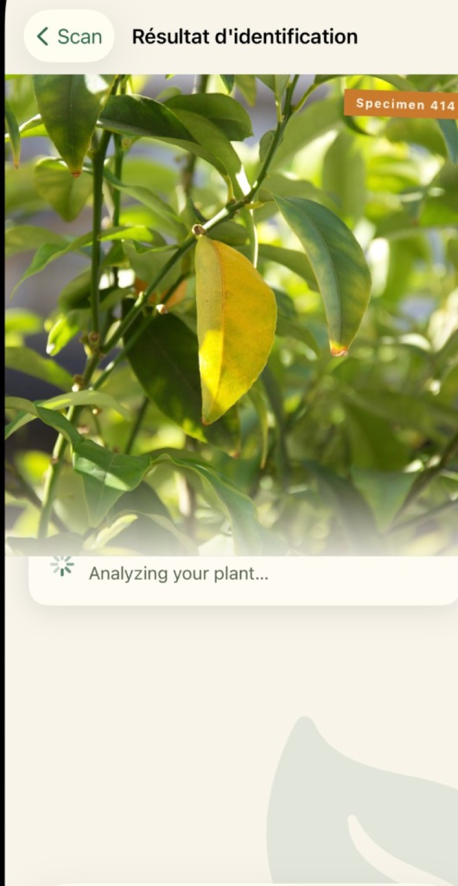

# PlantPal

**Every plant, kept thriving.**

PlantPal is an iOS field journal for your houseplants — identify species from a photo, check their health, and keep a watering ledger that feels like a notebook, not a spreadsheet.

<p align="center">
  
  &nbsp;
  
  &nbsp;
  
</p>

<p align="center">
  
  &nbsp;
  
  &nbsp;
  
</p>

## Features

| | |
|---|---|
| **Identify** | Snap a leaf (or pick from your library) and get species, confidence, and alternate matches with catalog photos. |
| **Health check** | Diagnose yellowing, pests, and watering issues — plant link optional until you want to save. |
| **My Garden** | Polaroid-style specimen cards with nicknames, vigour, and next watering. |
| **Water ledger** | Overdue / today / upcoming reminders with water, snooze, and reschedule. |
| **Plant expert** | Chat with Luna about a plant; attach a photo in the conversation. |
| **Discover** | Browse the species catalog (Perenual, cached through your API proxy). |
| **Languages** | English, French, and German UI + cached translations of care / ID content. |

## Stack

- **App:** SwiftUI, iOS 18+, [XcodeGen](https://github.com/yonaskolb/XcodeGen)
- **Backend:** [Supabase](https://supabase.com/) (Auth, Postgres, Storage, Edge Functions)
- **AI:** OpenAI via `ai-proxy` (identify, health, care guide, plant expert)
- **Species data:** [Perenual](https://perenual.com/) via `perenual-proxy` (names + images cached in DB / Storage)
- **i18n:** `translate-proxy` caches FR/DE field translations per species

## Quick start

### Prerequisites

- Xcode 26+ (or current stable with iOS 18 SDK)
- [XcodeGen](https://github.com/yonaskolb/XcodeGen) (`brew install xcodegen`)
- [Supabase CLI](https://supabase.com/docs/guides/cli) (for functions / migrations)
- Apple Developer team for device installs

### Run the app

```bash
cp .env.example .env   # fill secrets if you use local tooling
xcodegen generate
open PlantPal.xcodeproj
```

Select the **PlantPal** scheme and run on a simulator or device.

Demo garden plants and offline AI fallbacks are **simulator-only**. Physical device installs start with an empty garden.

### Backend

See [`supabase/README.md`](supabase/README.md) for migrations, secrets, and edge function deploy steps (`ai-proxy`, `perenual-proxy`, `translate-proxy`).

```bash
supabase link --project-ref <your-ref>
supabase db push
supabase secrets set OPENAI_API_KEY=… PERENUAL_API_KEY=…
supabase functions deploy ai-proxy --use-api
supabase functions deploy perenual-proxy --use-api
supabase functions deploy translate-proxy --use-api
```

## Project layout

```
Sources/          SwiftUI app (views, models, services, state)
Resources/        Assets + Localizable / InfoPlist string catalogs
supabase/         Migrations + Edge Functions
docs/screenshots/ README images
project.yml       XcodeGen project definition
```

## Privacy

Camera and photo library access are used only to identify plants, run health checks, and attach private photos to your plant records. Photos stay under your account (or on-device for guests).

## License

Private project — all rights reserved unless otherwise noted.
